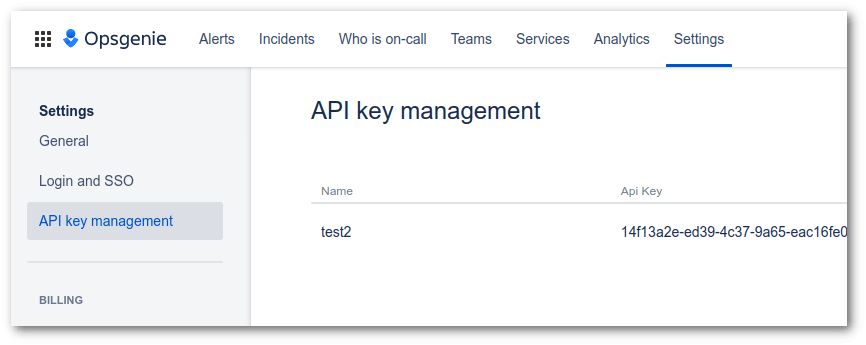
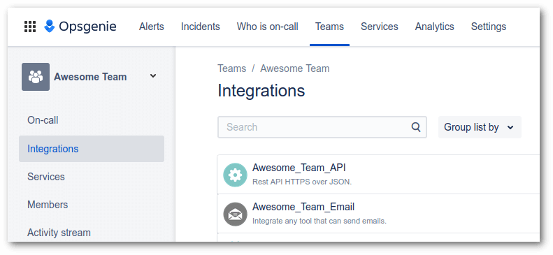

# OpsGenie Notifications Channel for Laravel

[](https://github.com/artkonekt/opsgenie-laravel/actions?query=workflow%3Atests)
[](https://packagist.org/packages/konekt/opsgenie-laravel)
[](https://packagist.org/packages/konekt/opsgenie-laravel)
[](https://styleci.io/repos/389939873)
[](LICENSE.md)

This package enables Laravel 8 and 9 Applications to send notification to OpsGenie.

## Installation

```bash
composer require konekt/opsgenie-laravel
```

### Configuration

Add your Auth Token, and endpoint config to your application's `config/services.php`:

```php
// config/services.php
...

'opsgenie' => [
    'auth_token' => env('OPSGENIE_AUTH_TOKEN'),
    'europe' => true, // OPTIONAL: if true, then the EU API endpoint will be used
    // 'endpoint' => 'https://some.custom.endpoint/', // VERY OPTIONAL: in case you use a non-official endpoint
],
...
```

#### A Note on The OpsGenie API Key

To create an alert, you need an API key from an
<span style="color:green">**API Integration ✔**</span> and
<span style="color:red">**NOT a "normal" API key ❌**</span>.

Normal API keys can be found at Settings -> API key management:



Integration API keys can be fount ad Teams -> {TEAM} -> Integrations:



> See more details at [this Atlassian Forum Thread](https://community.atlassian.com/t5/Opsgenie-questions/API-authentication-for-create-alerts/qaq-p/1477556#M773)

## Usage

At the moment of writing there are only 2 OpsGenie commands implemented:

- [Create an Alert](https://docs.opsgenie.com/docs/alert-api#create-alert)
- [Ping a Heartbeat](https://docs.opsgenie.com/docs/heartbeat-api#ping-heartbeat-request)

### Standalone Mode

To send a command to OpsGenie without using the Laravel Notifications
subsystem, you need to obtain the client, create a command and execute
it.

#### Creating an Alert

```php

use Konekt\OpsGenie\Client\OpsGenieClient;
use Konekt\OpsGenie\Commands\CreateAlert;

$genie = app(OpsGenieClient::class);
$genie->execute(CreateAlert::withMessage('I am an alert message'));
```

#### Pinging a Heartbeat

```php

use Konekt\OpsGenie\Client\OpsGenieClient;
use Konekt\OpsGenie\Commands\PingHeartbeat;

$genie = app(OpsGenieClient::class);
$genie->execute(new PingHeartbeat('name of the heartbeat'));
```

### Laravel Notifications

You can use the OpsGenie channel in your `via()` method inside a
Notification class. The following example creates an alert with the
given message at OpsGenie:

```php
use Illuminate\Notifications\Notification;
use Konekt\OpsGenie\Commands\CreateAlert;
use Konekt\OpsGenie\Contracts\OpsGenieCommand;
use Konekt\OpsGenie\Contracts\OpsGenieNotification;
use Konekt\OpsGenie\Notification\OpsGenieChannel;

class SiteProblem extends Notification implements OpsGenieNotification
{
    private string $message;

    public function __construct(string $message)
    {
        $this->message = $message;
    }

    public function via($notifiable)
    {
        return [OpsGenieChannel::class];
    }

    public function toOpsGenie($notifiable): OpsGenieCommand
    {
        return CreateAlert::withMessage($this->message);
    }
}
```

To trigger the sending of the notification, use:

```php
Notification::send(['*'], new SiteProblem('Hey, there is a problem here'));
```

Apart from triggering an alert, the Laravel Notification you create can
send any OpsGenie command, eg. pinging a hearbeat:

```php
use Illuminate\Notifications\Notification;
use Konekt\OpsGenie\Commands\PingHeartbeat;
use Konekt\OpsGenie\Contracts\OpsGenieCommand;
use Konekt\OpsGenie\Contracts\OpsGenieNotification;
use Konekt\OpsGenie\Notification\OpsGenieChannel;

class ERPSyncCompleted extends Notification implements OpsGenieNotification
{
    private string $heartbeat;

    public function __construct(string $heartbeat)
    {
        $this->heartbeat = $heartbeat;
    }

    public function via($notifiable)
    {
        return [OpsGenieChannel::class];
    }

    public function toOpsGenie($notifiable): OpsGenieCommand
    {
        return new PingHeartbeat($this->heartbeat);
    }
}
```

To send this notification use:

```php
Notification::send(['*'], new ERPSyncCompleted('erp-sync-heartbeat'));
```

#### Customizing Alerts

It is possible to set further attributes of the created alerts like
[setting priority](https://support.atlassian.com/opsgenie/docs/what-is-the-priority-level-of-integration/)
or adding description, etc.

This can be done when instantiating the `CreateAlert` command for
example in the `toOpsGenie` method:

```php
class CriticalConditionDetected extends Notification implements OpsGenieNotification
{
    private string $message;

    public function __construct(string $message)
    {
        $this->message = $message;
    }

    public function via($notifiable)
    {
        return [OpsGenieChannel::class];
    }

    public function toOpsGenie($notifiable): OpsGenieCommand
    {
        $alert = new Alert('Shit hit the fan', ['priority' => 'P1']);
        
        return new CreateAlert($alert);
    }
}
```
